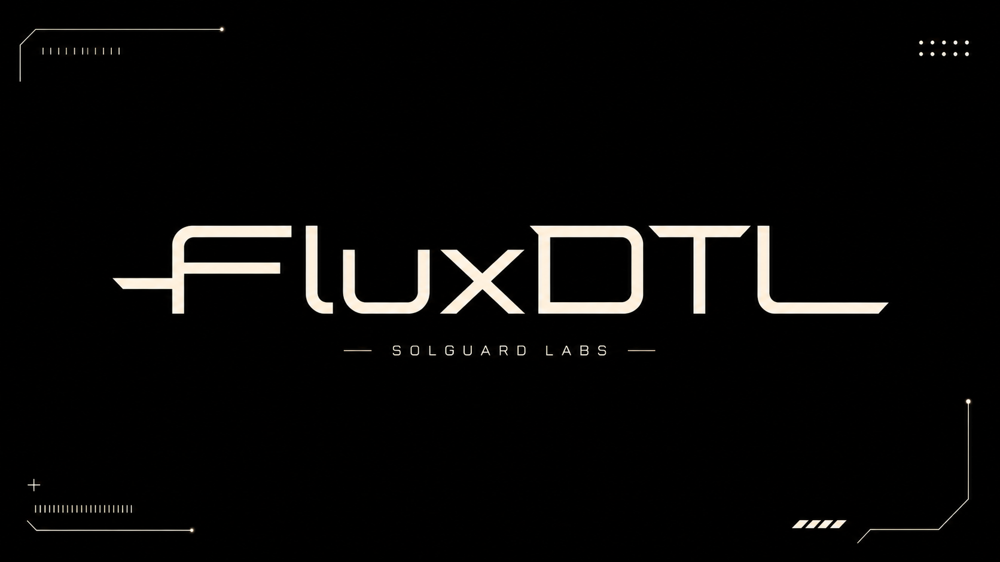
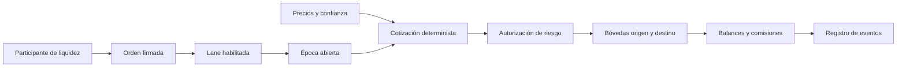
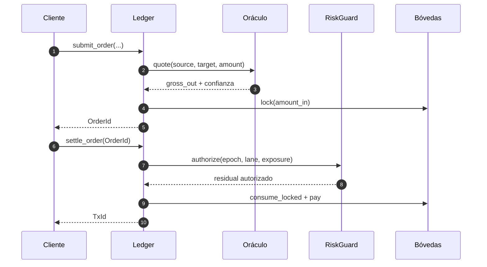
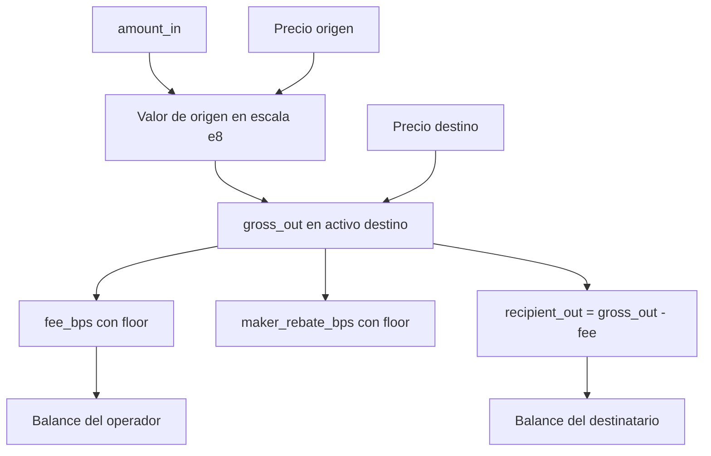
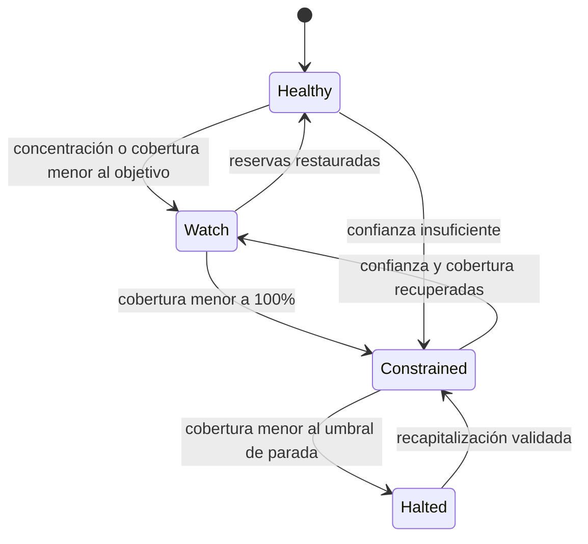

# FluxDTL



FluxDTL es un motor determinista de transferencia, compensación y liquidación
multi-activo. Organiza el flujo financiero en rutas bilaterales (`lanes`),
agrupa órdenes dentro de épocas operativas y mueve reservas entre bóvedas con
precios, límites de exposición y trazabilidad explícita.

La versión `1.0.0` entrega el núcleo en Rust, una consola reproducible, un SDK
local en JavaScript y controles de publicación para Linux y Windows. Todo el
cálculo monetario emplea enteros; no se usa coma flotante en el dominio de
liquidación.

## Visión del sistema



Cada orden referencia una ruta concreta, un propietario, un destinatario, un
importe de entrada, una salida mínima y un `nonce`. Antes de aceptarla, el
sistema calcula la cotización y bloquea la reserva de origen. Al liquidarla,
repite la valoración, aplica la política de riesgo y registra el movimiento.



## Modelo monetario

Los precios usan escala `1e8`, mientras que cada activo conserva sus propios
decimales. Para una cantidad `q_s` del activo origen, la salida bruta se obtiene
mediante aritmética entera y redondeo hacia abajo:

```text
value_e8  = q_s × price_source_e8 / 10^decimals_source
gross_out = value_e8 × 10^decimals_target / price_target_e8
fee       = floor(gross_out × fee_bps / 10_000)
recipient = gross_out - fee
```

El redondeo conservador hace que cada ejecución sea reproducible en cualquier
plataforma. `min_out` protege el precio esperado del remitente y la confianza
del oráculo debe superar el umbral de la ruta.



## Control de tesorería

El módulo `treasury` añade evaluación preventiva de reservas. Valora cada
activo, aplica `haircut`, recupera solo una fracción configurable de entradas
esperadas y calcula cobertura, déficit, utilización y concentración. La salida
se clasifica en `healthy`, `watch`, `constrained` o `halted`.



La evaluación es pura: no muta el ledger ni depende de red, reloj o servicios
externos. Esto permite ejecutar escenarios de estrés en planificación,
observabilidad y controles previos a una ventana de liquidación.

## Componentes

| Módulo       | Responsabilidad                                                      |
| ------------ | -------------------------------------------------------------------- |
| `accounts`   | Cuentas y balances denominados por activo.                           |
| `amount`     | Aritmética comprobada, ratios y puntos básicos.                      |
| `asset`      | Registro, decimales, estado y peso de riesgo.                        |
| `oracle`     | Precios deterministas y confianza por activo.                        |
| `vault`      | Reservas, bloqueos, pagos y modos operativos.                        |
| `lanes`      | Rutas, bóvedas, operador y política económica.                       |
| `orders`     | Intenciones de transferencia y estado de ejecución.                  |
| `epochs`     | Agrupación y acumuladores de cada ventana.                           |
| `settlement` | Cotización, comisión, incentivo y salida neta.                       |
| `risk`       | Límites de nocional, residual y utilización.                         |
| `treasury`   | Estrés de liquidez, cobertura y concentración.                       |
| `ledger`     | Coordinación de estado y secuencia transaccional.                    |
| `sdk`        | Cliente local tipado por contrato de datos para automatización Node. |

## Inicio rápido

Requisitos:

- Rust estable con Cargo y edición 2021;
- Node.js 24 o posterior y npm 11 o posterior;
- Git y un shell compatible con los comandos habituales de desarrollo.

```bash
npm ci
cargo run -- demo
cargo run -- demo-json
cargo run -- stress-json
```

El SDK ejecuta la misma consola sin shell intermedio, controla tiempo máximo,
captura `stdout`/`stderr` y valida el esquema del informe:

```js
import { FluxClient } from "./sdk/client.js";

const flux = new FluxClient({ timeoutMs: 30_000 });
const report = flux.demo();
const snapshot = flux.snapshot();

console.log(report.settled_volume);
console.log(snapshot.status, snapshot.creditRatioBps);
```

## Validación

```bash
npm run test:rust
npm test
npm run ci
```

La validación completa comprueba formato, sintaxis JavaScript, compilación,
tests, `clippy -D warnings`, estructura documental, versiones, integridad del
banner y reproducibilidad del árbol. GitHub Actions ejecuta el mismo contrato
en Ubuntu y Windows.

## Documentación

- [Arquitectura](./docs/arquitectura.md)
- [Modelo económico](./docs/modelo-economico.md)
- [Ciclo de liquidación](./docs/liquidacion.md)
- [Seguridad operativa](./docs/seguridad-operativa.md)
- [Operaciones](./docs/operaciones.md)
- [Integración](./docs/integracion.md)
- [Despliegue](./docs/despliegue.md)
- [Política de seguridad](./SECURITY.md)

## Publicación

`main`, `production` y el tag anotado `v1.0.0` identifican exactamente el
mismo commit publicado. La release `Production 1.0.0` representa la línea de
producción reproducible de esta versión.

## Licencia

Consulta [LICENSE](./LICENSE).
