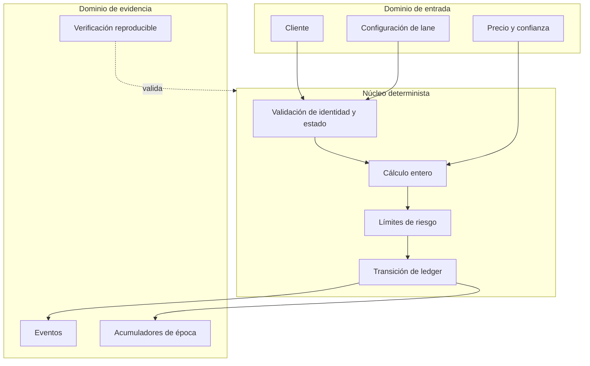
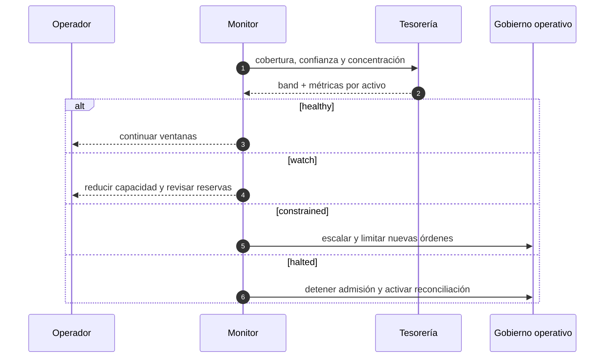

# Política de seguridad de FluxDTL

FluxDTL aplica seguridad por capas al ciclo de cotización, encolado,
autorización y liquidación. La política cubre el núcleo Rust, el SDK, la
configuración de CI y los artefactos asociados a una publicación.

## Modelo de confianza

Las entradas se consideran no confiables hasta validar existencia, estado,
relación entre identificadores y límites cuantitativos. Los precios incorporan
un indicador de confianza, las operaciones monetarias son comprobadas y las
bóvedas separan reserva total de importe bloqueado.

## Controles obligatorios

- Solo se aceptan activos registrados y habilitados.
- Las bóvedas de una ruta deben corresponder a sus activos de origen y destino.
- Una orden debe pertenecer a una época abierta y a una ruta activa.
- La cotización debe satisfacer `min_out` en aceptación y ejecución.
- La confianza del precio debe superar el mínimo configurado.
- La entrada queda bloqueada antes de incorporarse al lote.
- El límite de nocional, residual y utilización se evalúa antes del pago.
- Una orden liquidada no vuelve a procesarse.
- Sumas, restas, productos y divisiones monetarias fallan de forma cerrada.
- Cada publicación conserva versiones, activos y referencias Git verificables.

## Matriz de superficies

| Superficie        | Riesgo principal                     | Control verificable                           |
| ----------------- | ------------------------------------ | --------------------------------------------- |
| Orden             | repetición o estado inválido         | `nonce`, estado pendiente y `OrderId` único   |
| Precio            | dato ausente o de baja confianza     | `PricePoint` y umbral por ruta                |
| Bóveda            | pago superior a disponibilidad       | `available`, `lock`, `pay` y resta comprobada |
| Época             | acumulación fuera de ventana         | estado abierto/cerrado y límites por ruta     |
| Tesorería         | déficit o concentración excesiva     | cobertura estresada y bandas operativas       |
| Automatización    | comando colgado o salida incorrecta  | tiempo máximo y validación de esquema         |
| Cadena de entrega | divergencia entre código y artefacto | CI matricial, hashes y referencias alineadas  |

## Supuestos y límites

El proceso confía en que la gobernanza suministra precios con procedencia
autorizada, mantiene las claves operativas fuera del repositorio y asigna
controladores coherentes a las bóvedas. El núcleo no abre puertos, no administra
secretos ni realiza llamadas de red. La integración con custodia, firma,
mensajería y persistencia debe imponer autenticación, autorización, rotación y
auditoría propias.

## Gestión de secretos

No se deben confirmar claves privadas, frases de recuperación, tokens, datos
de clientes ni credenciales de infraestructura. Los consumidores deben usar un
gestor de secretos, credenciales de duración limitada y permisos mínimos. Los
logs deben registrar identificadores técnicos, nunca material de firma.

## Respuesta ante incidentes

1. Detener la admisión de nuevas órdenes en las rutas afectadas.
2. Conservar eventos, configuración, commit, versión y salidas de verificación.
3. Reconciliar órdenes pendientes, reservas, bloqueos y pagos por época.
4. Delimitar activos, bóvedas y ventanas implicadas.
5. Aplicar una corrección revisada con pruebas de regresión.
6. Publicar una versión nueva y verificar la alineación de referencias.
7. Reabrir capacidad de forma gradual tras una revisión independiente.

## Comunicación responsable

Los informes de seguridad deben enviarse mediante la función privada de
GitHub Security Advisories del repositorio. Incluye versión y commit, impacto,
precondiciones, secuencia mínima reproducible, resultado observado, resultado
esperado y propuesta de corrección. No publiques detalles operativos antes de
que exista una actualización disponible.

## Versiones admitidas

| Versión | Estado                 |
| ------- | ---------------------- |
| `1.0.x` | mantenida              |
| `<1.0`  | fuera de mantenimiento |
