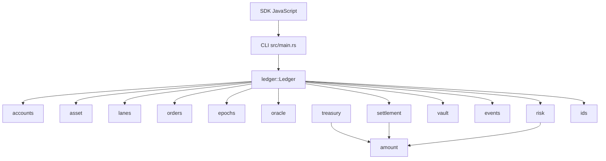
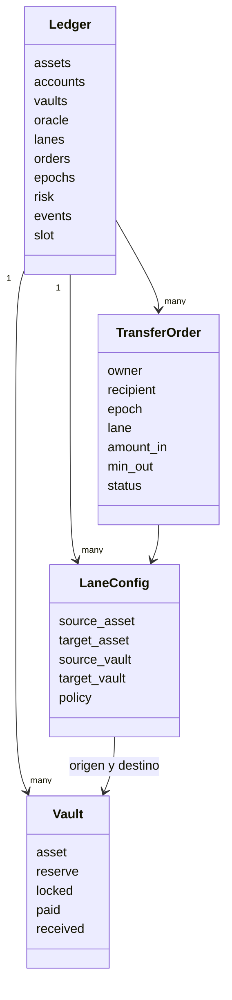
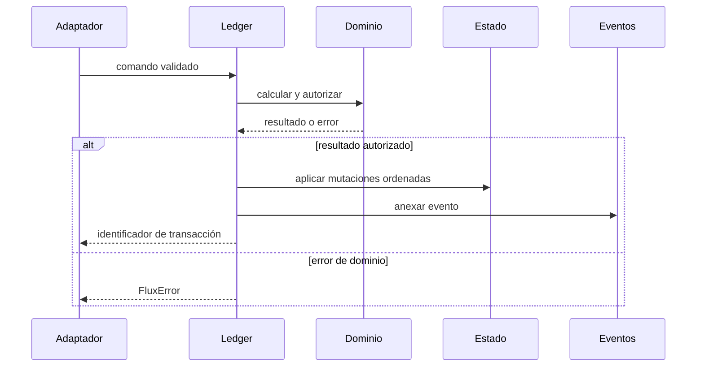

# Arquitectura de FluxDTL

## Propósito

FluxDTL separa definición de dominio, cálculo financiero y transición de estado.
El ledger coordina componentes pequeños y deterministas; cada uno impone una
responsabilidad concreta sin acceso a red ni almacenamiento externo. Esta
separación permite reproducir una liquidación desde configuración, precios,
órdenes y eventos.

## Mapa de módulos

`Amount` encapsula `u128` y expone operaciones comprobadas. Los tipos de ID
impiden confundir semánticamente cuentas, activos, bóvedas, rutas, órdenes,
épocas y transacciones. El error de dominio es explícito y cada frontera
devuelve `FluxResult<T>`.

## Agregados de estado

El agregado raíz contiene los registros y contadores necesarios para que una
transición sea atómica desde el punto de vista del proceso:

| Agregado            | Clave       | Datos principales                        |
| ------------------- | ----------- | ---------------------------------------- |
| Registro de activos | `AssetId`   | símbolo, decimales, peso y habilitación  |
| Cuentas             | `AccountId` | etiqueta y balances                      |
| Bóvedas             | `VaultId`   | activo, modo, reserva, bloqueado y pagos |
| Rutas               | `LaneId`    | par, bóvedas, operador y política        |
| Órdenes             | `OrderId`   | partes, época, importes, nonce y estado  |
| Libro de épocas     | `EpochId`   | lotes y acumuladores                     |
| Libro de precios    | `AssetId`   | precio, confianza y slot                 |
| Registro de eventos | secuencia   | hechos operativos inmutables             |

## Límites de responsabilidad

- `oracle` transforma cantidades mediante precios y decimales.
- `settlement` deriva salida bruta, comisión, incentivo y salida del receptor.
- `risk` autoriza exposición de una orden dentro de una época.
- `vault` mantiene disponibilidad y aplica movimientos comprobados.
- `epoch` acumula volumen y residual por ruta.
- `treasury` produce una lectura preventiva de liquidez sin mutar el ledger.
- `events` conserva la secuencia necesaria para observación y reconciliación.

No se ocultan efectos externos dentro de los cálculos. El binario recibe un
comando, ejecuta el escenario y emite texto o JSON; el SDK convierte ese
contrato en una interfaz programática con tiempo máximo y errores estructurados.

## Frontera transaccional

La implementación actual es monoproceso y en memoria. Una adaptación persistente
debe envolver la secuencia de mutaciones en una transacción real y hacer que el
evento se confirme en la misma unidad de trabajo o mediante un outbox atómico.

## Extensiones previstas

Los adaptadores de persistencia, firma y mensajería deben permanecer fuera del
núcleo. Para incorporar uno, se recomienda definir un puerto estrecho, conservar
los tipos de dominio, traducir errores en el borde y ejecutar pruebas de contrato
contra la implementación en memoria y la externa.
