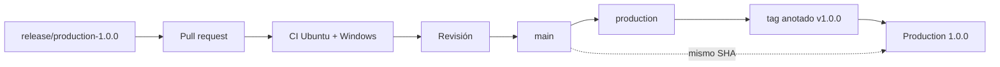
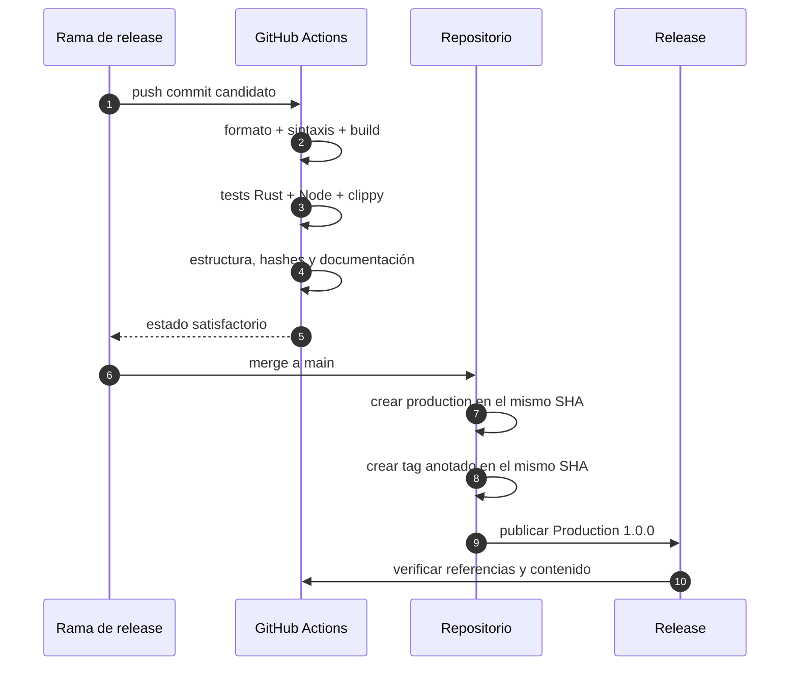
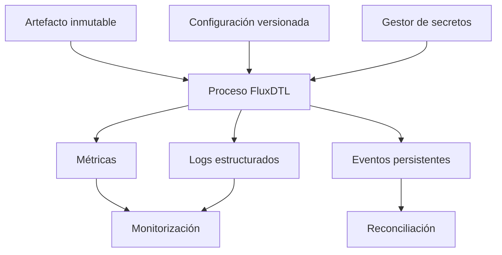

# Despliegue y promoción

## Principio de artefacto único

Una publicación de FluxDTL parte de un commit ya revisado. El mismo commit debe
identificar `main`, `production` y el tag anotado de versión. No se recompila ni
se modifica código entre estas referencias.



## Requisitos de plataforma

| Elemento | Versión o propiedad                        |
| -------- | ------------------------------------------ |
| Rust     | canal estable, edición 2021                |
| Cargo    | lockfile obligatorio                       |
| Node.js  | 24 o posterior                             |
| npm      | 11 o posterior, instalación con `npm ci`   |
| Sistemas | Ubuntu y Windows verificados               |
| Permisos | lectura en CI, escritura solo en promoción |

## Flujo de validación



El workflow de integridad se activa en `main`, `production`, tags y publicación
de release. En las fases finales compara las referencias remotas y resuelve el
tag anotado hasta el commit subyacente.

## Comandos de verificación

```bash
npm ci
npm run ci
git status --short
git rev-parse main
git rev-parse production
git rev-parse 'v1.0.0^{}'
```

Los tres últimos hashes deben coincidir tras completar la promoción. El árbol
de trabajo también debe quedar limpio después de ejecutar toda la suite.

## Configuración externa

Una instancia conectada a custodia o mensajería necesita configuración fuera
del repositorio. Se recomienda:

- variables o ficheros montados en modo solo lectura;
- secretos obtenidos en tiempo de arranque desde un gestor autorizado;
- identidad distinta por entorno;
- límites de recursos y tiempo de proceso;
- red de salida denegada salvo destinos explícitos;
- logs estructurados con redacción de datos sensibles;
- hash de configuración incorporado al informe operativo.



## Reversión

La reversión selecciona una publicación anterior completa; no edita archivos
en una instancia. Antes de cambiar el binario se detiene la admisión, se cierra
o inventaría la época activa y se conserva el estado. Tras restaurar, se
comprueba compatibilidad de datos, se ejecuta una reconciliación y se reabre
capacidad gradualmente.

## Criterios de aceptación

- [ ] Suite local satisfactoria y árbol limpio.
- [ ] PR revisada con las dos plataformas en verde.
- [ ] Versiones Cargo y npm en `1.0.0`.
- [ ] Documentación y banner incluidos.
- [ ] `main`, `production` y `v1.0.0` en el mismo commit.
- [ ] Tag anotado y release `Production 1.0.0` publicados.
- [ ] Workflow de integridad satisfactorio después de la release.
