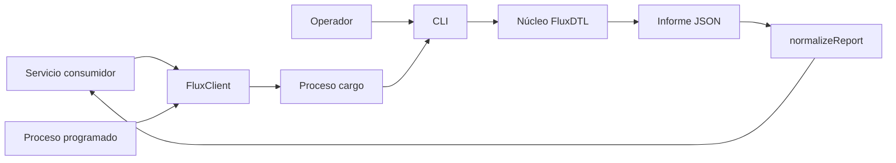
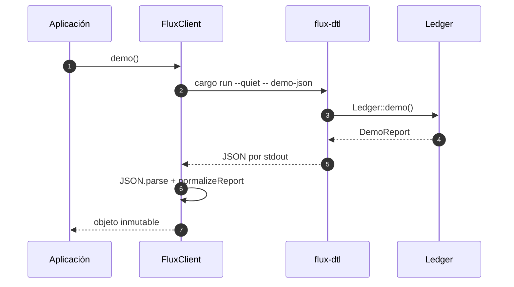
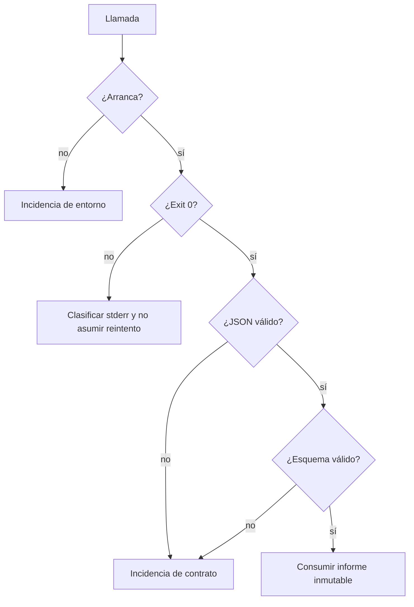

# Guía de integración

## Contratos disponibles

FluxDTL ofrece dos fronteras locales:

- una CLI Rust para ejecución humana o automatizada;
- un SDK JavaScript que ejecuta la CLI sin shell, limita la duración y valida
  la respuesta.



## CLI

```bash
cargo run -- demo
cargo run -- demo-json
cargo run -- help
```

`demo` produce un resumen legible y `demo-json` emite un único objeto JSON. Un
comando desconocido termina con código distinto de cero y escribe el motivo en
`stderr`.

Contrato de `demo-json`:

| Campo               | Tipo   | Significado                          |
| ------------------- | ------ | ------------------------------------ |
| `accounts`          | entero | cuentas registradas                  |
| `assets`            | entero | activos registrados                  |
| `vaults`            | entero | bóvedas registradas                  |
| `lanes`             | entero | rutas configuradas                   |
| `epochs`            | entero | épocas creadas                       |
| `events`            | entero | eventos emitidos                     |
| `settled_volume`    | entero | volumen bruto pagado por bóvedas     |
| `liquidity_credits` | entero | saldo operativo agregado del informe |

## SDK JavaScript

```js
import { FluxClient } from "./sdk/client.js";

const client = new FluxClient({
    cargo: "cargo",
    timeoutMs: 30_000,
    env: { RUST_LOG: "warn" },
});

const report = client.demo();
const snapshot = client.snapshot();
```

`FluxClient.run` solo acepta un array de cadenas, no interpola comandos y usa
`spawnSync` con `shell` desactivado. Si el proceso falla, lanza un error que
incluye `exitCode`, `stdout` y `stderr`. El consumidor debe registrar el código
y un identificador de correlación, sin copiar datos sensibles.



## Tratamiento de errores

La integración debe distinguir:

1. error de arranque del proceso, como binario ausente;
2. tiempo máximo excedido;
3. salida no satisfactoria del comando;
4. JSON sintácticamente incorrecto;
5. informe con esquema o rangos inválidos;
6. error funcional comunicado por `FluxError`.

No conviene reintentar automáticamente todos los casos. Los errores de precio,
capacidad o política requieren una nueva condición de estado. Un fallo temporal
del adaptador puede reintentarse con espera exponencial, límite estricto y clave
idempotente.



## Integración persistente

Para exponer comandos de ledger mediante HTTP, cola o RPC, mantén un adaptador
delgado. Autentica antes de construir IDs, valida rangos antes de entrar en el
dominio y confirma estado más evento dentro de una unidad atómica. El núcleo no
debe recibir cabeceras, tokens, conexiones ni tipos de una biblioteca de red.

## Compatibilidad

La rama `1.0.x` conserva los nombres y tipos del informe de demostración. Añadir
campos es compatible si los consumidores toleran propiedades desconocidas;
eliminar, renombrar o cambiar unidades exige una versión mayor.
