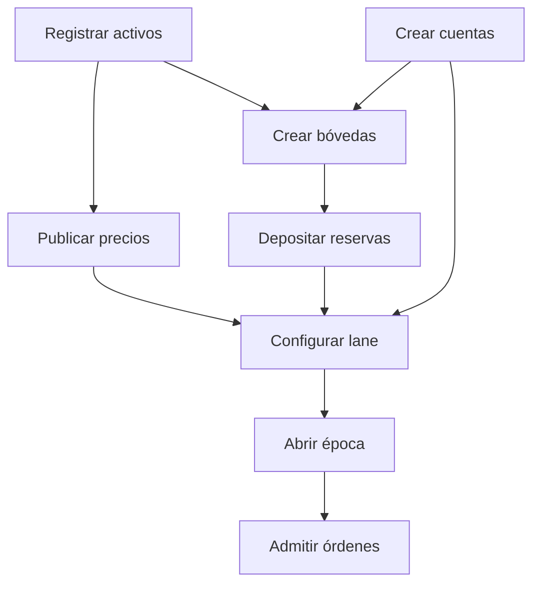
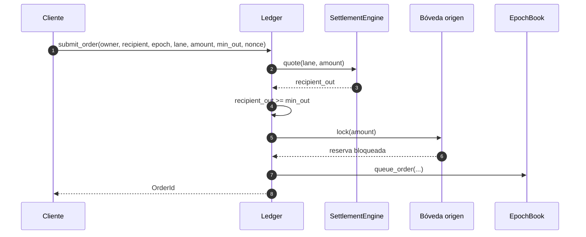
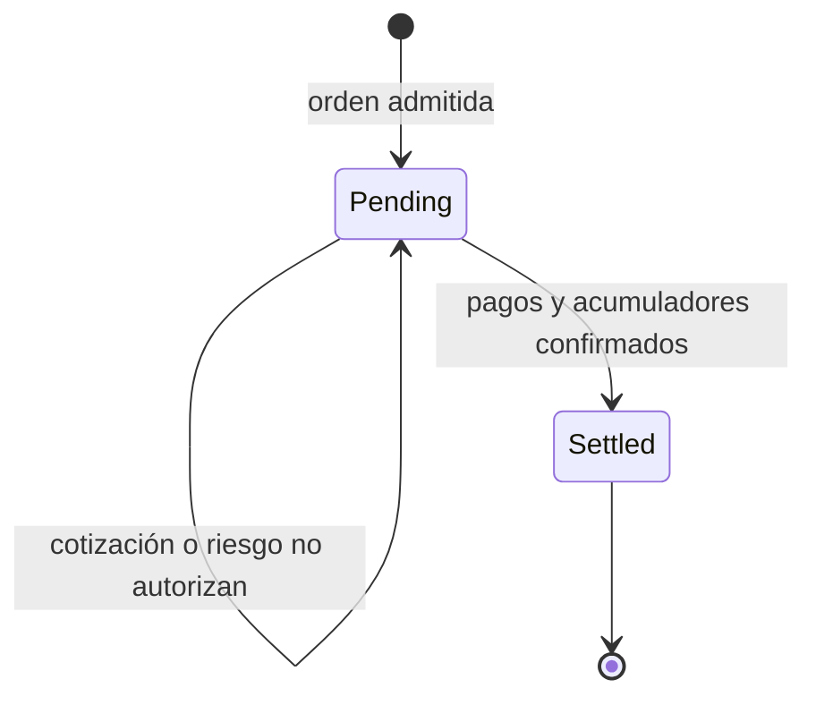

# Ciclo de liquidación

## Preparación

Una ventana comienza con activos, cuentas, precios y bóvedas previamente
registrados. La ruta relaciona dos activos con sus bóvedas y un operador. La
época agrupa las órdenes que comparten periodo de control.

El orden operativo evita referencias incompletas. `create_lane` verifica que
las bóvedas existan, que cada una corresponda al activo declarado y que el
operador esté registrado.

## Admisión de una orden

`submit_order` recibe propietario, destinatario, época, ruta, importe, salida
mínima y `nonce`. La admisión sigue esta secuencia:

1. comprueba cuentas y configuración;
2. confirma que la ruta está habilitada;
3. calcula una cotización actual;
4. compara la salida neta con `min_out`;
5. bloquea el importe en la bóveda de origen;
6. incorpora la orden al lote de la época;
7. registra `OrderQueued`.

Una respuesta satisfactoria indica admisión, no pago final. El cliente debe
seguir el estado hasta observar `OrderSettled` y el identificador de
transacción correspondiente.

## Ejecución

La ejecución vuelve a leer orden y ruta. Recalcula la cotización para no usar
una valoración obsoleta y vuelve a exigir `min_out`. Después obtiene una
instantánea de la bóveda destino y solicita autorización de riesgo.

Si el resultado es válido:

- consume el bloqueo de origen;
- paga la salida bruta desde la bóveda destino;
- acredita la salida neta al destinatario;
- acredita la comisión al operador;
- registra los acumuladores de época;
- marca la orden como liquidada;
- emite `OrderSettled` y avanza el slot.

Los errores de dominio son cerrados: ausencia de precio, confianza baja,
salida mínima incumplida, reserva insuficiente o límite excedido impiden
obtener un `TxId` satisfactorio.

## Cierre y reconciliación

`close_epoch` impide incorporar trabajo adicional a la ventana. El cierre
operativo debe comparar:

- órdenes encoladas frente a órdenes liquidadas;
- importe bloqueado frente a importe consumido o liberado;
- pagos de bóveda frente a balances y eventos;
- volumen, comisiones, incentivos y residual por ruta;
- configuración y precios usados durante la ventana.

La salida `demo-json` sirve como contrato mínimo de integración. Para una
plataforma persistente se recomienda conservar un informe por época con hash
de configuración, rango de slots, conteo de eventos y estado de reconciliación.

## Idempotencia en integraciones

El adaptador debe asignar una clave idempotente externa a cada solicitud y
relacionarla con el `OrderId`. Un reintento por pérdida de respuesta debe
consultar primero esa relación. El `nonce` forma parte del dominio, pero la
deduplicación entre redes, colas y bases de datos corresponde al adaptador.
