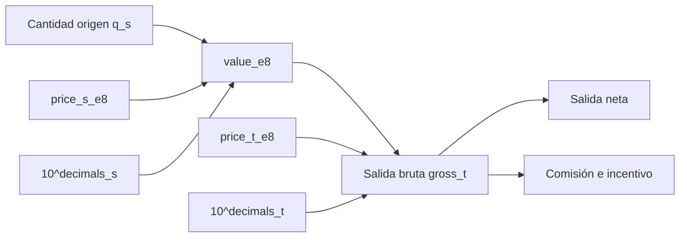
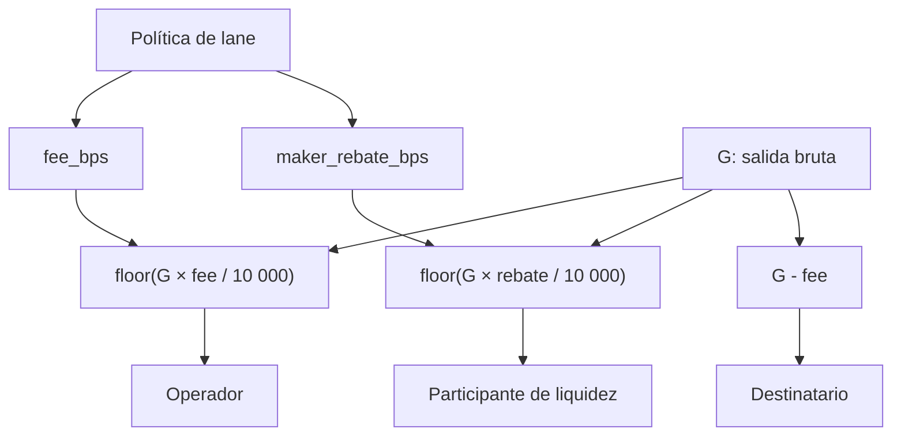
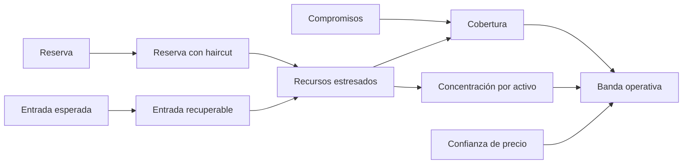

# Modelo económico

## Unidades y valoración

FluxDTL trabaja con cantidades enteras. Un activo `a` define `decimals_a` y el
oráculo publica `price_a_e8`. El valor normalizado de una cantidad es:

```text
value_e8(q_a) = floor(q_a × price_a_e8 / 10^decimals_a)
```

La conversión entre activo origen `s` y destino `t` conserva el mismo valor
normalizado y redondea hacia abajo:

```text
gross_t = floor(value_e8(q_s) × 10^decimals_t / price_t_e8)
```



El redondeo siempre favorece la conservación del sistema: no se promete una
unidad fraccionaria que el activo no pueda representar. El cliente debe definir
`min_out` después de considerar tolerancia de precio, comisión y redondeo.

## Economía de una ruta

Cada ruta fija:

- `fee_bps`: comisión sobre la salida bruta;
- `maker_rebate_bps`: incentivo de provisión;
- `min_confidence_bps`: calidad mínima de precios;
- `max_epoch_notional`: volumen máximo dentro de una época;
- `max_residual`: exposición no compensada permitida;
- `utilization_cap_bps`: fracción máxima de la bóveda de destino.

Para una cotización `G`:

```text
protocol_fee = floor(G × fee_bps / 10_000)
maker_rebate = floor(G × maker_rebate_bps / 10_000)
recipient_out = G - protocol_fee
```



La comisión y el incentivo tienen finalidades distintas. La primera remunera
operación y capacidad; el segundo reconoce la aportación de flujo. La suma debe
ser compatible con los objetivos de margen, liquidez y competitividad de cada
ruta.

## Riesgo de época

Una época agrupa órdenes para medir el comportamiento conjunto. Antes de una
liquidación, `RiskGuard` contrasta el volumen acumulado, el residual resultante
y la utilización del inventario de destino con los límites de la ruta.

La configuración no debe copiarse entre pares sin recalibración. Activos con
profundidad, volatilidad, horarios o calidad de precio diferentes requieren
límites diferentes. Como mínimo se deben estimar:

1. volumen máximo absorbible durante la ventana;
2. salida de inventario bajo percentiles adversos;
3. tiempo de reposición de reservas;
4. dispersión y antigüedad del precio;
5. coste de cubrir el residual.

## Estrés de tesorería

El motor de tesorería convierte cada posición en cuatro magnitudes:

```text
reserve_value          = value_e8(reserve)
stressed_reserve       = reserve_value × (10_000 - haircut_bps) / 10_000
recoverable_inflow     = value_e8(inflow) × recovery_bps / 10_000
stressed_resources     = stressed_reserve + recoverable_inflow
coverage_bps           = stressed_resources × 10_000 / committed_value
```



La clasificación tiene precedencia conservadora:

| Banda         | Condición principal                                      | Decisión sugerida              |
| ------------- | -------------------------------------------------------- | ------------------------------ |
| `healthy`     | cobertura objetivo, confianza y concentración aceptables | mantener capacidad             |
| `watch`       | colchón menor al objetivo o concentración elevada        | reducir límites y reequilibrar |
| `constrained` | cobertura menor al 100% o confianza insuficiente         | restringir admisión y escalar  |
| `halted`      | cobertura menor al umbral de parada                      | detener admisión y reconciliar |

## Ejemplo de planificación

Una tesorería con dos activos puede evaluar una ventana antes de abrirla:

```rust
let policy = StressPolicy::default();
let report = TreasuryStressEngine::assess(policy, &exposures)?;

if !report.accepts_new_orders() {
    // Keep admission closed until treasury restores the required capacity.
}
```

El resultado no sustituye la reconciliación contable ni el control de custodia.
Es una señal determinista para convertir supuestos financieros en límites
operativos revisables.
