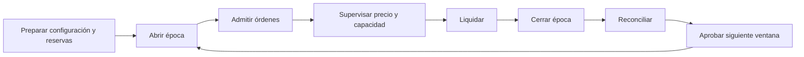
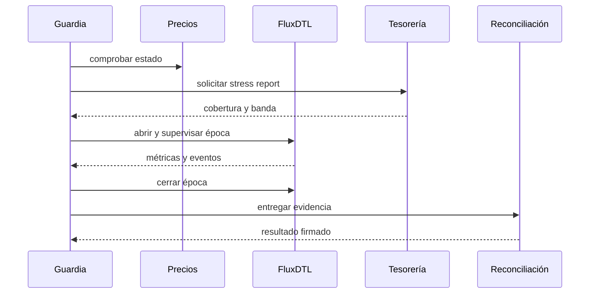
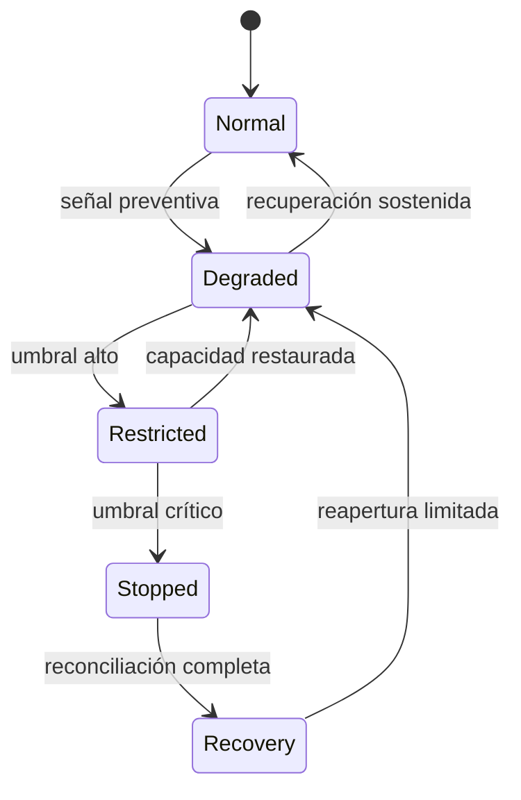

# Manual de operaciones

## Objetivo operativo

La operación de FluxDTL se divide en preparación, apertura, supervisión,
liquidación y reconciliación. Cada fase debe dejar una evidencia concreta y un
responsable identificable.



## Arranque local

```bash
npm ci
rustc --version
node --version
npm run ci
cargo run -- demo-json
```

La salida JSON esperada contiene ocho campos enteros no negativos. El SDK
valida este contrato y rechaza campos ausentes, negativos o fuera del rango
seguro de JavaScript.

```js
import { FluxClient } from "./sdk/client.js";

const client = new FluxClient();
const snapshot = client.snapshot();

if (snapshot.status !== "operational") {
    throw new Error("FluxDTL is not producing an operational snapshot");
}
```

## Cadencia diaria

### Antes de abrir

- comprobar salud del precio y sincronía del slot;
- reconciliar reservas con la fuente de custodia;
- ejecutar el escenario de tesorería vigente;
- validar capacidad y límites por ruta;
- confirmar que no existen órdenes antiguas sin resolución;
- registrar el commit y la configuración efectivos.

### Durante la ventana

- seguir utilización, residual, volumen y errores;
- comparar velocidad de admisión con capacidad de liquidación;
- reducir límites ante deterioro de confianza o cobertura;
- conservar la relación entre solicitudes externas, órdenes y transacciones.

### Al cerrar

- detener admisión;
- resolver o inventariar órdenes pendientes;
- cerrar la época;
- comparar acumuladores, eventos, balances y custodia;
- firmar el informe operativo.



## Umbrales y escalado

| Señal                                    | Nivel      | Acción inmediata                      |
| ---------------------------------------- | ---------- | ------------------------------------- |
| confianza cerca del mínimo               | preventivo | reducir tamaño y vigilar frecuencia   |
| concentración sobre política             | preventivo | reequilibrar y limitar la ruta        |
| cobertura estresada menor al objetivo    | preventivo | bloquear ampliaciones                 |
| cobertura menor al 100%                  | alto       | restringir nuevas órdenes             |
| cobertura menor al umbral de parada      | crítico    | detener admisión y reconciliar        |
| divergencia entre eventos y acumuladores | crítico    | congelar avance y preservar evidencia |



## Copia y restauración

Una instalación persistente debe conservar configuración versionada, precios,
órdenes, épocas, bóvedas, balances, eventos e identificadores de idempotencia.
La restauración se valida en un entorno aislado reproduciendo un rango de
eventos y comparando el hash de estado resultante con un punto conocido.

## Registro de cambios

Toda modificación operativa debe incluir motivo, autor, revisor, instante de
activación, parámetros anteriores y nuevos, rutas afectadas y plan de reversión.
Los cambios de código se promueven mediante commit inmutable y nunca mediante
edición directa de una instancia activa.
