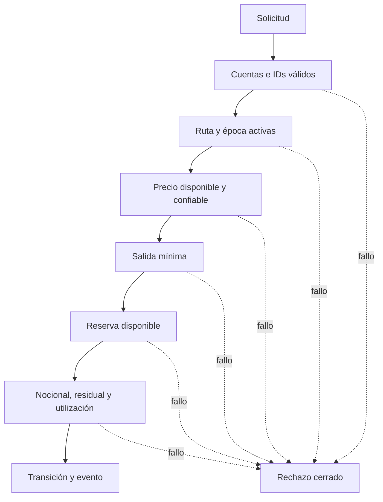
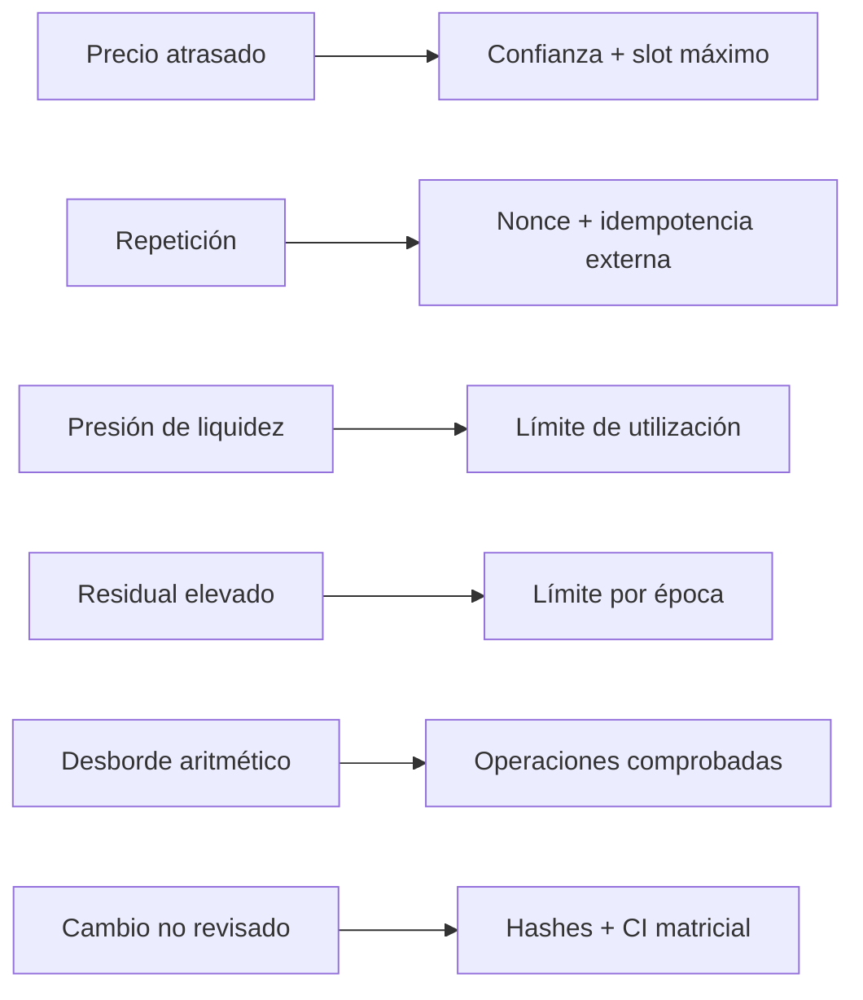
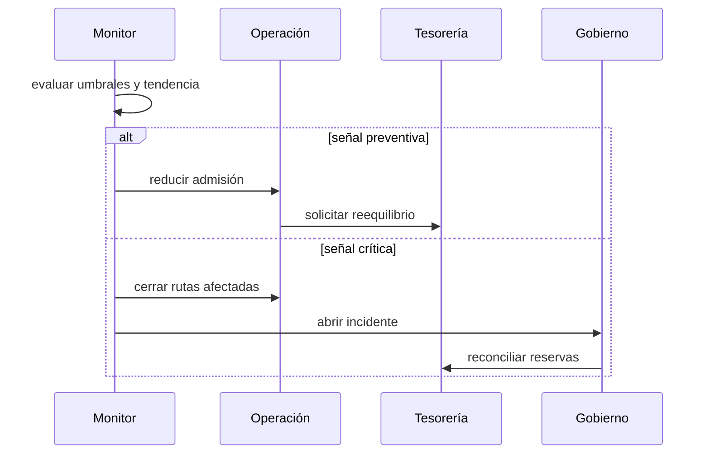

# Seguridad operativa

## Defensa por capas

El diseño combina validaciones de identidad, estado, precio, liquidez y riesgo.
Ninguna señal aislada debe interpretarse como autorización suficiente para
abrir una ventana o elevar capacidad.

## Roles operativos

| Rol                 | Puede                                              | No debe                                      |
| ------------------- | -------------------------------------------------- | -------------------------------------------- |
| Gobierno            | aprobar activos, rutas y límites                   | ejecutar con revisión propia únicamente      |
| Operador de ruta    | aportar capacidad y observar épocas                | cambiar precios o aprobar su propia custodia |
| Operador de precios | publicar precio, confianza y slot                  | mover reservas                               |
| Tesorería           | financiar, reequilibrar y cerrar capacidad         | modificar el historial                       |
| Reconciliación      | comparar eventos, lotes, balances y transferencias | firmar pagos                                 |
| Publicación         | promover un commit verificado                      | alterar código durante promoción             |

En una integración real, estos roles deben mapearse a identidades distintas,
permisos mínimos y aprobación múltiple en operaciones de alto impacto.

## Amenazas y controles

Además de las comprobaciones del núcleo, el despliegue debe limitar antigüedad
de precio, frecuencia de actualización, tamaño por orden y ritmo por cuenta.
La configuración debe versionarse y cualquier cambio de parámetros debe
producir evidencia aprobable antes de entrar en vigor.

## Monitores recomendados

- confianza y edad del último precio por activo;
- volumen admitido y liquidado por ruta y época;
- utilización disponible, bloqueada y pagada por bóveda;
- residual absoluto y relativo a la capacidad;
- cobertura estresada y concentración por activo;
- órdenes pendientes por antigüedad;
- divergencia entre acumuladores y eventos;
- tasa de errores por clase de `FluxError`;
- coincidencia entre commit ejecutado y versión autorizada.

## Procedimiento de contención

Ante una inconsistencia material:

1. deshabilitar las rutas relacionadas sin borrar estado;
2. cerrar la época activa o congelar su avance;
3. preservar eventos, parámetros, precios y binario;
4. reconciliar movimientos desde la última época confirmada;
5. determinar el alcance económico por activo y bóveda;
6. preparar una corrección con pruebas de regresión;
7. ejecutar revisión independiente y promoción controlada.

No se deben editar manualmente balances para hacer coincidir informes. Toda
regularización requiere una transición explícita, aprobada y auditable.

## Lista previa a una ventana

- [ ] Fuentes de precio disponibles y dentro de antigüedad permitida.
- [ ] Confianza superior al mínimo de cada ruta.
- [ ] Reservas reconciliadas con custodia.
- [ ] Cobertura y concentración dentro de política.
- [ ] Límites de época revisados para las condiciones actuales.
- [ ] Alertas, responsable de guardia y ruta de escalado activos.
- [ ] Commit de ejecución coincidente con la publicación autorizada.
